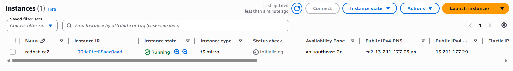
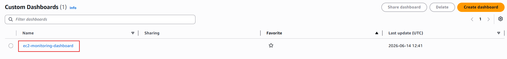
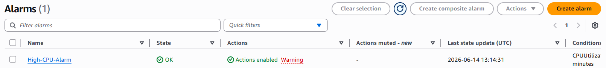

# AWS CloudWatch Monitoring Project

## Objective

Monitor AWS EC2 instance using Amazon CloudWatch.

---

## Services Used

- AWS EC2
- AWS CloudWatch
- Metrics
- Dashboard
- Alarm

---

## Step 1 - Launch EC2 Instance

Launch an EC2 instance for monitoring.

---

## Step 2 - View CloudWatch Metrics

View EC2 metrics in CloudWatch.

---

## Step 3 - Create Dashboard

Create a CloudWatch Dashboard.

---

## Step 4 - Add Metrics to Dashboard

Add EC2 CPU Utilization metric to the dashboard.

---

## Step 5 - Create CloudWatch Alarm

Create an alarm for EC2 CPU Utilization.

---

## Step 6 - Verify Monitoring Configuration

Verify dashboard and alarm configuration.

---

# Final Result

Successfully monitored AWS EC2 instance using Amazon CloudWatch.
